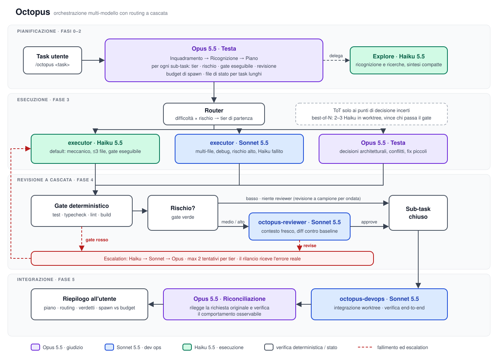

# Octopus

```text
                        _.--~~~~~~~--._          o
                    .-~'               '~-.   O
                 .-'      .         .      '-.     .
               .'    o                   o    '.
              /            .       .            \
             /    .                         .    \
             |        o                 o        |
             |      .-~~-.           .-~~-.      |
             |     / .--. \         / .--. \     |
             |     | |()| |         | |()| |     |
             |     \ '--' /         \ '--' /     |
             |      '-..-'           '-..-'      |
              \             `.___.'             /
               '.                             .'
               / / / / | | | |   | | | | \ \ \ \
              /o/ | |  /o/ | |   | | \o\  | | \o\
             / /  /o/ | |  |o|   |o|  | | \o\  \ \
            / /  / /  | |  \ \   / /  | |  \ \  \ \
           /o/  | |   /o/   | | | |   \o\   | |  \o\
          / /   /o/  | |    |o| |o|    | |  \o\   \ \
         / /   | |   | |    / / \ \    | |   | |   \ \
        /o/    / /   \o\   | |   | |   /o/   \ \    \o\
        |     |o|     | |  |o|   |o|  | |     |o|     |
        |      |      | |  \ \   / /  | |      |      |
     @-'       \       \    | | | |    /       /       '-@
                \       |    |   |    |       /
              @'        |    /   \    |        '@
                        '@  /     \  @'
                          @'       '@
```

Comando `/octopus` per Claude Code: orchestra task lunghi e complessi su tre modelli, instradando ogni sub-task al livello più economico che può riuscire e salendo solo su evidenza di fallimento.



## Idea

Un dynamic workflow spende modelli forti ovunque. Octopus inverte il rapporto: il modello più costoso decide, quelli economici lavorano, e i verificatori eseguibili (test, typecheck, lint, build) vengono prima di qualunque giudizio LLM.

| Livello | Modello | Agente | Ruolo |
|---|---|---|---|
| Testa | Opus 5.5 | comando `/octopus` | piano, routing, adiudicazione, riconciliazione finale |
| Dev ops | Sonnet 5.5 | `octopus-devops`, `octopus-reviewer` | verifica e integrazione, revisione a contesto fresco, sub-task di difficoltà media |
| Esecutore | Haiku 5.5 | `executor`, `Explore` | implementazione meccanica, ricognizione, ricerche |

Per far salire un sub-task di livello non serve un agente nuovo: `executor` viene rilanciato con `model: "sonnet"`.

## Fasi

0. **Inquadramento.** Al massimo 2-3 domande, solo su ciò che il codice non chiarisce.
1. **Ricognizione.** Agenti `Explore` su Haiku, sintesi compatte. Si individuano i comandi di verifica e la baseline git.
2. **Piano.** Sub-task autocontenuti con brief scritto, tier di partenza, rischio, gate eseguibile, livello di revisione e budget di spawn. Per task lunghi, ondate con checkpoint di integrazione e file di stato.
3. **Esecuzione.** Un `executor` per sub-task, in parallelo se i file sono disgiunti, in worktree isolati altrimenti. Dopo ogni executor un controllo di integrità in sola lettura.
4. **Revisione a cascata.** Prima il gate deterministico, poi, in base al rischio, `octopus-reviewer`.
5. **Integrazione.** `octopus-devops` esegue la verifica end-to-end; Opus riconcilia il risultato con la richiesta originale.

## Routing

| Livello di partenza | Quando |
|---|---|
| Haiku | modifica locale (≤ 3 file), specifica non ambigua, criterio di accettazione eseguibile, pattern già presente nel codice |
| Sonnet | più file accoppiati, debugging con causa ignota, contratti condivisi, rischio alto, oppure Haiku ha già fallito |
| Opus | decisioni architetturali, conflitti tra sub-task, fallimento anche a Sonnet |

Escalation: Haiku, poi Sonnet, poi Opus, massimo 2 tentativi per livello. Il rilancio riceve l'errore reale del tentativo precedente.

## Modalità di ragionamento

| Modalità | Uso | Costo |
|---|---|---|
| Plan-and-execute a cascata | default per ogni task | basso |
| CoT | ragionamento interno dei modelli; Haiku scrive un piano breve prima di editare | trascurabile |
| ToT | solo ai punti di decisione incerti e difficili da annullare: 2-3 candidati Sonnet, Opus sceglie | alto, da usare di rado |
| Best-of-N | sub-task difficili con test oggettivi: 2-3 executor Haiku in worktree, vince chi supera il gate | medio, senza bias da giudice LLM |
| Debate | solo su finding di revisione in conflitto ad alto rischio | alto |

## Contesto e cache

In una sessione lunga il consumo dipende soprattutto da quanto contesto viene rispedito o riscritto a ogni turno. Due default di Claude Code pesano sulle orchestrazioni (verificati sulla versione 2.1.295):

| Meccanismo | Default | Perché pesa |
|---|---|---|
| Auto-compact | scatta vicino al riempimento della finestra, circa 967k token sui modelli da 1M | fino ad allora ogni turno rispedisce l'intera storia; anche se letta in gran parte dalla cache, conta sui limiti di utilizzo |
| Cache dei subagent | TTL di 5 minuti (la conversazione principale, con l'abbonamento, ha 1 ora) | un agente fermo più di 5 minuti, in attesa di revisione, build o test, riscrive tutto il suo contesto al turno successivo |

Come li gestisce Octopus:

- `executor`, `octopus-reviewer` e `octopus-devops` dichiarano `experimental.cacheTtl: 1h` nel frontmatter: sono gli agenti che restano fermi durante revisioni, build e test. `Explore` resta a 5 minuti perché è monouso. La scrittura in cache a 1 ora costa più di quella a 5 minuti, quindi conviene solo dove le pause sono frequenti.
- Gli agenti sono monouso, un executor per sub-task. Un agente fermo oltre il suo TTL non viene ripreso con SendMessage: lo sostituisce un agente nuovo con brief e finding.
- La testa tiene lo stato su file e suggerisce `/compact` prima delle pause lunghe, finché la cache è calda: il riassunto costa una lettura, la ripresa a cache scaduta riscrive tutta la storia.
- Per flussi indipendenti che durano ore propone sessioni separate, ciascuna con il proprio file di stato.

### Impostazioni di sessione

`session.json` vale solo per la sessione in cui gira `/octopus` e non tocca le impostazioni globali:

| Chiave | Valore | Effetto |
|---|---|---|
| `autoCompactWindow` | `400000` | l'auto-compact scatta intorno ai 367k token invece che a 967k |
| `promptCacheTtl` | `"1h"` | cache di 1 ora per la testa anche con API key; con l'abbonamento è già il default |
| `env.OCTOPUS_SESSION` | `"1"` | permette alla testa di capire se la sessione è stata avviata con queste impostazioni |

Si passa all'avvio con `--settings`, che ha la precedenza sulle impostazioni utente e progetto solo per quella sessione. Non usare `/autocompact`: salva il valore nelle impostazioni globali.

Precedenza del TTL dei subagent, dalla più forte: `FORCE_PROMPT_CACHING_5M`, la variabile `CLAUDE_CODE_SUBAGENT_PROMPT_CACHE_TTL`, l'impostazione `subagentPromptCacheTtl`, `experimental.cacheTtl` dell'agente, la variabile `ENABLE_PROMPT_CACHING_1H`. Un `subagentPromptCacheTtl` globale sovrascrive quindi il TTL dei singoli agenti: usalo solo se vuoi 1 ora anche per gli agenti monouso. Con l'abbonamento in overage il TTL a 1 ora viene ignorato.

## Installazione

```sh
./install.sh
```

Copia il comando e gli agenti in `~/.claude` e le impostazioni di sessione in `~/.claude/octopus/session.json`. Rifiuta di sovrascrivere file esistenti; con `--force` li sostituisce. La destinazione si cambia con `CLAUDE_HOME`.

Claude Code carica le definizioni degli agenti all'avvio: dopo l'installazione apri una nuova sessione.

## Uso

```sh
claude --settings ~/.claude/octopus/session.json "/octopus <task da realizzare>"
```

Per non riscriverlo ogni volta, un alias nella shell:

```sh
alias octopus='claude --settings ~/.claude/octopus/session.json'
```

`/octopus` funziona anche in una sessione normale, ma con l'auto-compact di default; per i task lunghi la testa suggerisce di riavviare con le impostazioni di sessione.

Con un repo git sono disponibili worktree e best-of-N. Senza git i sub-task con file in comune vengono serializzati e la revisione avviene senza diff.

## Struttura

```
commands/octopus.md          comando e logica di orchestrazione
agents/executor.md           esecutore su Haiku 5.5
agents/octopus-reviewer.md   revisore a contesto fresco su Sonnet 5.5
agents/octopus-devops.md     verifica e integrazione su Sonnet 5.5
session.json                 impostazioni della sessione /octopus
docs/architecture.svg        diagramma dell'architettura
install.sh                   installazione in ~/.claude
```
